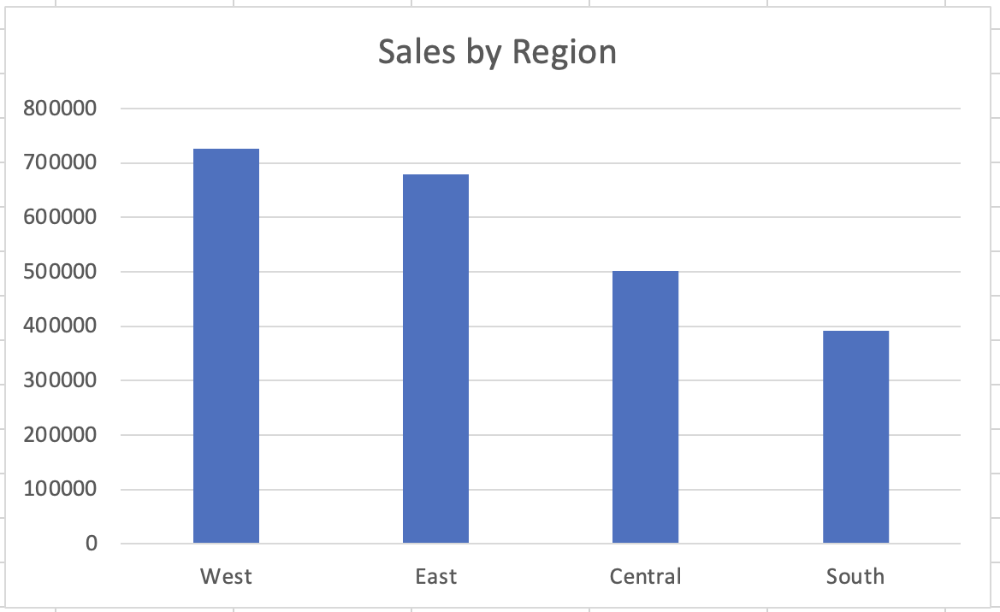
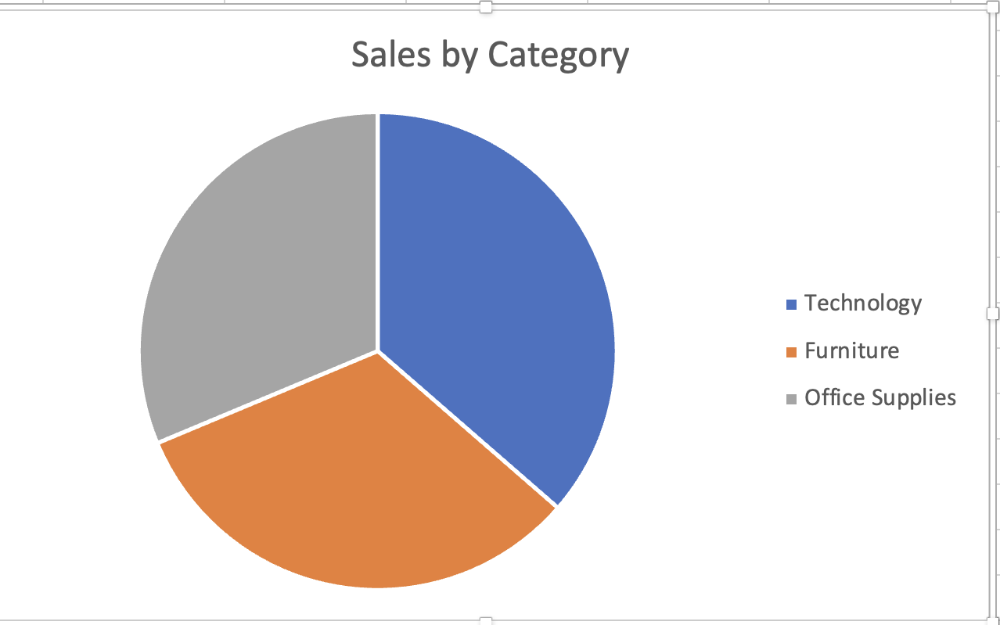
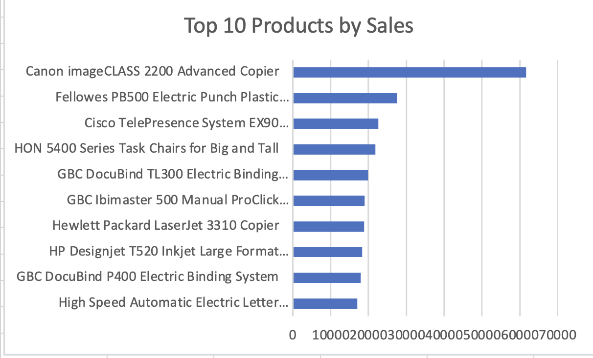
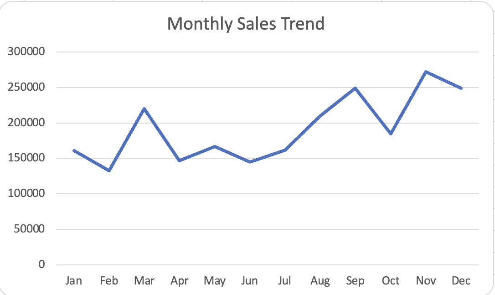

# Business Sales Performance Analytics

## Project Overview

This project analyzes business sales data to identify revenue trends, top-performing products, category performance, and regional sales distribution.

The goal is to extract meaningful business insights that help understand sales performance and customer demand patterns.

## Dataset

The dataset used for this analysis is the **Superstore Sales Dataset**, which contains information about:

* Orders
* Products
* Sales
* Profit
* Customer segments
* Regions

## Tools Used

* Excel
* Pivot Tables
* Data Visualization
* Business Data Analysis

## Analysis Performed

1. Data Quality Check
2. Sales by Region Analysis
3. Sales by Category Analysis
4. Top 10 Products by Sales
5. Monthly Sales Trend Analysis

## Key Insights

* The **West region** generates the highest sales among all regions.
* **Technology products** contribute the largest share of revenue.
* The **Canon imageCLASS 2200 Advanced Copier** is the highest revenue-generating product.
* Sales increase toward the **end of the year**, with November showing the highest performance.

## Dashboard Visualizations

### Sales by Region

### Sales by Category

### Top 10 Products by Sales

### Monthly Sales Trend

## Conclusion

This analysis highlights key sales trends and identifies top-performing regions, categories, and products. These insights can help businesses make data-driven decisions to improve sales strategies and product focus.

